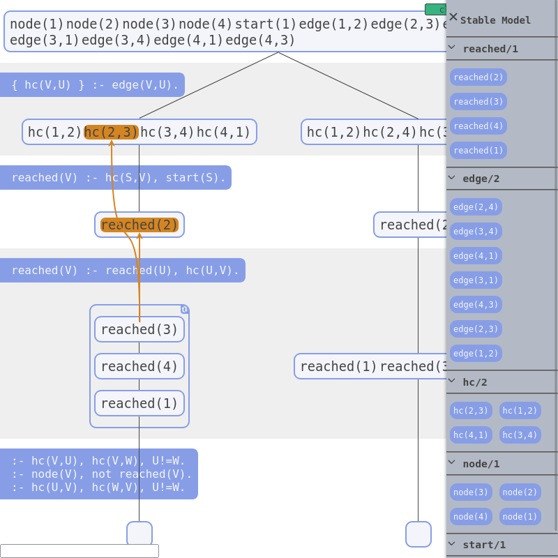

# viASP

**viASP visualizes an interactive explanation of your ASP program and its stable models** 

Try it out in Binder!

viASP allows you to explore the visualization in a variety of ways:

* Inspect iterations of recursive rules individually
* Explain the derivation of symbols with arrows
* Relax the constraints of unsatisfiable programs
* Toggle parts of the program
* Show the added symbols or all of them
* Inspect a single model
* Add `#show` statements on the fly
* Search models, signatures and rules.

To use viASP you don't have to change your ASP programs at all. You only have to execute them using the clingo python
API.

# Installation

1. Clone the repository using `git clone https://github.com/stephanzwicknagl/viasp.git --depth 1`
2. Create and activate a conda environment
3. Install pip `conda install pip`
4. Install viasp in editable mode `pip install -e viasp -e viasp/backend -e viasp/frontend`

## Usage

### Overview

viASP has two parts, its frontend [Dash](https://dash.plotly.com) component and the backend server. To get everything
running, do the following:

1. Start your dash app, a basic version can be found at [`examples/minimal_dash.py`](examples/minimal_dash.py). This will also automatically start the backend server.
2. Replace `clingo.Control` with `viasp.Control` in your python scripts and use `viasp.mark(model)` to select the models
   you want to show

### Quick start

If you don't have any scripts handy that use the python API of clingo, you can use our quickstart script.

Simply run [`examples/quickstart.py`](examples/quickstart.py).

It works very similar to the usual `clingo`, you can call it as `python quickstart.py encoding.lp` or
even `cat encoding | python quickstart.py`
If you want to filter the models you have to edit the script, however.

If you now run your ASP programs, you can inspect them using viASP at [http://127.0.0.1:8050/](http://127.0.0.1:8050/)
or what ever port you have set.

If you want to learn more about Dash, check out their [documentation](https://dash.plotly.com/layout).

# API Reference

| Name                            | Description and Parameters                                                                                                  |
|---------------------------------|-----------------------------------------------------------------------------------------------------------------------------|
| load\_program\_file             | Load a (non-ground) program file into the viasp backend                                                                     |
|                                 | `str` *or* `List[str]`: path or list of paths to the program file                                               |
| load\_program\_string       | Load a (non-ground) program into the viasp backend                                                                          |
|                                 | `str`: the program to load                                                                                                |
| add\_program\_file          | Add a (non-ground) program file to the viasp backend                                                                        |
|                                 | `str`: name, `Sequence[str]`: parameters, `str`: path                                                                 |
|                                 | *or*                                                                                                                 |
|                                 | `str`: path                                                                                                               |
| add\_program\_string        | Add a (non-ground) program to the viasp backend                                                                             |
|                                 | `str`: name, `Sequence[str]`: parameters, `str`: program                                                              |
|                                 | *or*                                                                                                                 |
|                                 | `str`: program                                                                                                               |
|  mark\_from\_clingo\_model   | Mark a program from a clingo model                                                                                          |
|                                 | `clingo.solving.Model`: the model to mark                                                                                 |
| mark\_from\_string          | Parse a string of ASP facts and mark them as a model.                                                                       |
|                                 | `str`: The facts of the model to mark.                                                                                    |
| mark\_from\_file            | Parse a file containing a string of ASP facts and mark them as a model.                                                     |
|                                 | `str` *or* `List[str]` The path or list of paths to the file containing the facts of the model to mark.          |
| unmark\_from\_clingo\_model | Unmark a program from a clingo model                                                                                        |
|                                 | `clingo.solving.Model`: the model to unmark                                                                               |
| unmark\_from\_string   | Parse a string of ASP facts and unmark the corresponding model.                                                             |
|                                 | `str`: The facts of the model to unmark.                                                                                  |
| unmark\_from\_file       | Parse a file containing a string of ASP facts and unmark the corresponding model.                                           |
|                                 | `str` *or* `List[str]`: The path or list of paths to the file containing the facts of the model to unmark. |
| clear                      | Clear all marked models.                                                                                                    |
| show                        | Propagate the marked models to the backend and generate the graph.                                                          |
| get\_relaxed\_program       | Relax constraints in the marked models. Returns the relaxed program as a string.                                            |
|                                 | `str`: name of the head literal, `bool`: collect variables from body                                                      |
| relax\_constraints          | Relax constraints in the marked models. Returns a new viASP control object with the relaxed program loaded and all stable models marked. |
|                                 | `str`: name of the head literal, `bool`: collect variables from body |
| clingraph                   | Generate a clingraph from the marked models and the visualization encoding.                                                 |
|                                 | `str`: The path to the visualization encoding, `str`: The visualization engine. `str`: the graph type                    |
| register\_transformer       | Register a transformer to the backend. The backend transforms the program in the backend before further processing is made. |
|                                 | `clingo.ast.Transformer`: transformer, `str`: imports used by the transformer, `str`: path to the transformer            |

# Contributing

## Installation

#### Requirements

- [Git](https://git-scm.com)
- [Node.JS](https://nodejs.org)
- [Python](https://www.python.org/)
- A suitable browser

#### Starting

1. Clone the repository using `git clone https://github.com/stephanzwicknagl/viasp.git --depth 1`
2. Create and activate a conda environment
3. Install pip `conda install pip`
4. Install viasp in editable mode `pip install -e viasp -e viasp/backend -e viasp/frontend`

## Developing the backend

1. Simply edit the code in the backend folder `viasp/backend/src`
3. Start viasp with your clingo program `python examples/App.py /your/program.lp`
## Developing the frontend

1. Move to frontend folder `cd viasp/frontend`
2. Run `npm i` to install all needed dependencies
3. Run `npx webpack` to pack the javascript
5. Start viasp with your clingo program `python examples/App.py 0 /your/program.lp`

Note: the JavaScript and css files are located in `/frontend/src/lib`. The frontend code needs to be packed before changes become visible to the webpage.

Code your heart out!
